# LearnTrack — Cohort Learning Operations Console

LearnTrack is a small terminal-based LMS project built for the Core Java assignment. It handles the usual learning-management work: students, trainers, courses, enrollments, seat capacity, waitlists, reports, and action history. The project uses plain Java and in-memory `ArrayList` storage, so it can be compiled and tested with only the JDK.

The menu is organized like an admin console. **Learner Desk** handles students, **Course Catalog Ops** handles courses, **Enrollment Desk** handles enrollment decisions, **Reports & Signals** shows system status, **Action Journal** keeps operation history, and **Guided Demo** walks through the main workflow. The required classes such as `Student`, `Course`, `Enrollment`, `Person`, and `Trainer` are kept easy to find in the source code.

---

## Quick start

Prerequisite: JDK 17 or newer. The project uses only Core Java; there is no Maven, Gradle, database, JDBC, GUI toolkit, or external dependency.

From the project root:

```bash
find . -name "._*" -delete
rm -rf out
javac -d out $(find src -name "*.java")
java -cp out com.airtribe.learntrack.ui.Main
```

Run the smoke test:

```bash
java -cp out com.airtribe.learntrack.test.LearnTrackSmokeTest
```

Expected final line:

```text
Smoke Test Summary: PASS=16 FAIL=0
```

---

## What LearnTrack manages

LearnTrack manages the main operational records used in a learning cohort:

- **Students / Learners**: profile creation, search, update, safe deactivation, reactivation, and Student Learning Trail.
- **Trainers**: trainer creation, search, update, safe deactivation, reactivation, and course assignment.
- **Courses**: course creation, generated course codes, duration, level, seat capacity, trainer assignment, active/inactive state, and enrollment window.
- **Enrollments**: accepted enrollments, waitlisted enrollments, completed enrollments, cancelled enrollments, duplicate-prevention, and waitlist promotion.
- **Operational records**: action journal entries and operation receipts for important changes.
- **Reports**: Learning Pulse Dashboard, Course Operations Card, Cohort Health Score, Capacity Report, Waitlist Report, Trainer Coverage Report, People Directory, and Student Learning Trail.

---

## Assignment coverage map

| Rubric area | Required work | Where it is implemented |
|---|---|---|
| Environment setup | JDK setup, compile/run instructions, JVM explanation | `docs/Setup_Instructions.md`, `docs/JVM_Basics.md` |
| Packages | entity, service, UI, exception, util, docs | `src/com/airtribe/learntrack/...` and `docs/` |
| Static members | ID counters and utility behavior | `IdGenerator`, `InputValidator`, `ConsolePrinter`, `TextTablePrinter`, `RuleExplainer` |
| Encapsulation | private fields with getters and setters | `Student`, `Trainer`, `Course`, `Enrollment`, `ActionLogEntry`, `OperationReceipt`, `EnrollmentDecision` |
| Constructors | default, parameterized, and overloaded constructors | core entity classes, especially `Student`, `Course`, and `Enrollment` |
| Inheritance | base class and child classes | `Person` extended by `Student` and `Trainer` |
| Overriding | specialized display behavior | `Student.getDisplayName()`, `Trainer.getDisplayName()` |
| Polymorphism | shared parent type used at runtime | People Directory uses `ArrayList<Person>` |
| Collections | dynamic in-memory storage | services store data using `ArrayList` |
| Control flow | menu choices, validation, reports | `switch`, `if/else`, `for` loops across UI, services, and reports |
| Exception handling | clean handling of invalid input and missing records | custom exceptions under `exception` package |
| Menu UI | console-based application | UI classes under `ui` package |
| Documentation | README, setup, JVM, design notes, class diagram | README plus files under `docs/` |

---

## Core workflows

The main behavior is built around lifecycle state, enrollment decisions, course capacity, receipts, journal entries, and reports.

### Lifecycle instead of physical deletion

Students, trainers, and courses are not permanently deleted. They are deactivated and can be reactivated. This preserves enrollment history and prevents accidental loss of learning records.

### Enrollment decisions

`EnrollmentService.enrollStudent()` returns an `EnrollmentDecision`. An enrollment attempt can be accepted, waitlisted, or rejected by a rule. The decision records the reason, rule code, enrollment object, and receipt.

### Course capacity and waitlists

Courses have `maxSeats`. If seats are available, the learner receives an `ACTIVE` enrollment. If the course is full but the enrollment window is open, the learner receives a `WAITLISTED` enrollment. When an active enrollment is cancelled, the oldest waitlisted learner is promoted.

### Rule codes

Rules have stable identifiers such as `LT-RULE-ENROLL-003` and `LT-RULE-DEACTIVATE-002`. These codes appear in exceptions, receipts, tests, and documentation.

### Operation receipts

Important successful operations create an `OperationReceipt`. A receipt records what happened, the outcome, the rule summary, the next suggested action, and the affected reference.

### Action journal

The action journal stores internal mutation history in memory. It records events such as student creation, course creation, trainer assignment, waitlisting, cancellation, and waitlist promotion.

### Reports as operating signals

Reports show course health, capacity utilization, trainer coverage, waitlists, student learning history, and cohort risk.

---

## Folder structure

```text
LearnTrack/
├── README.md
├── .gitignore
├── docs/
│   ├── Setup_Instructions.md
│   ├── JVM_Basics.md
│   ├── Design_Notes.md
│   ├── Signature_Design.md
│   ├── Design_Decisions_Matrix.md
│   ├── Rule_Catalog.md
│   ├── Manual_Test_Cases.md
│   ├── Demo_Guide.md
│   ├── Rubric_Coverage.md
│   ├── Scenario_Walkthrough.md
│   ├── system_architecture_diagrams/
│   └── demo_screenshots/
└── src/
    └── com/
        └── airtribe/
            └── learntrack/
                ├── entity/
                │   └── enums/
                ├── exception/
                ├── service/
                │   └── policy/
                ├── ui/
                ├── util/
                └── test/
```

---

## Documentation index

| Document | Purpose |
|---|---|
| `docs/Setup_Instructions.md` | Java setup, compile/run commands, Hello World explanation, and troubleshooting |
| `docs/JVM_Basics.md` | JDK, JRE, JVM, bytecode, classpath, and write-once-run-anywhere notes |
| `docs/Rubric_Coverage.md` | Direct map from assignment/rubric expectations to source files |
| `docs/Design_Notes.md` | Design explanations for OOP, ArrayList storage, lifecycle rules, and exception handling |
| `docs/Design_Decisions_Matrix.md` | Implementation choices and the Core Java concept behind each choice |
| `docs/Rule_Catalog.md` | Rule codes used in validation, exceptions, receipts, and tests |
| `docs/Manual_Test_Cases.md` | Manual test cases for checking menu flows and business rules |
| `docs/Demo_Guide.md` | Suggested terminal demo sequence |
| `docs/Scenario_Walkthrough.md` | End-to-end walkthrough of the main learning-operations scenario |
| `docs/Signature_Design.md` | Design details for receipts, reports, rule codes, and guided demo behavior |

---

## Package responsibilities

| Package | Responsibility |
|---|---|
| `entity` | Domain objects such as `Student`, `Trainer`, `Course`, `Enrollment`, `EnrollmentDecision`, `OperationReceipt`, and `ActionLogEntry` |
| `entity.enums` | Controlled values such as enrollment statuses, course levels, action types, and rule codes |
| `service` | In-memory storage and business logic |
| `service.policy` | Reusable business-rule checks for enrollment and safe deactivation |
| `ui` | Console menus and input handling |
| `exception` | Custom checked exceptions |
| `util` | Shared helper classes for validation, IDs, printing, seed data, and rule explanation |
| `test` | Smoke test and manual scenario runner using `main` methods |

---

## Important classes

| Class | Purpose |
|---|---|
| `Person` | Base class for people in the system |
| `Student` | Student profile with batch, goal, active flag, and join date |
| `Trainer` | Trainer profile with expertise and active flag |
| `Course` | Course catalog record with code, level, capacity, active state, enrollment window, and trainer reference |
| `Enrollment` | Student-course relationship with status and status-change details |
| `EnrollmentDecision` | Structured result of an enrollment attempt |
| `OperationReceipt` | User-facing confirmation of important operations |
| `ActionLogEntry` | Internal history record for system actions |
| `StudentService` | Student storage, validation, search, update, and lifecycle behavior |
| `TrainerService` | Trainer storage, search, update, and safe deactivation |
| `CourseService` | Course creation, updates, enrollment windows, trainer assignment, and lifecycle behavior |
| `EnrollmentService` | Enrollment decisions, status changes, waitlist handling, and promotion |
| `ReportService` | Dashboards, operational reports, trails, and health score |
| `ActionLogService` | Stores action journal entries |
| `ReceiptService` | Stores operation receipts |
| `EnrollmentPolicy` | Validates enrollment rules and status transitions |
| `DeactivationPolicy` | Validates safe deactivation rules |
| `Main` | Creates services and starts the console |

---

## Compile and run

Remove generated output and macOS resource files before compiling:

```bash
find . -name "._*" -delete
rm -rf out
```

Compile on Linux or macOS:

```bash
javac -d out $(find src -name "*.java")
```

Run the console app:

```bash
java -cp out com.airtribe.learntrack.ui.Main
```

Compile on Windows PowerShell:

```powershell
Remove-Item -Recurse -Force out -ErrorAction SilentlyContinue
Get-ChildItem -Recurse -Path . -Filter "._*" | Remove-Item -Force
Get-ChildItem -Recurse src -Filter *.java | ForEach-Object { $_.FullName } > sources.txt
javac -d out @sources.txt
```

Run on Windows PowerShell:

```powershell
java -cp out com.airtribe.learntrack.ui.Main
```

---

## Run checks

Smoke test:

```bash
java -cp out com.airtribe.learntrack.test.LearnTrackSmokeTest
```

Manual scenario runner:

```bash
java -cp out com.airtribe.learntrack.test.ManualScenarioRunner
```

The smoke test verifies duplicate email rejection, accepted enrollment, waitlisted enrollment, duplicate open enrollment rejection, waitlist promotion, closed enrollment window rejection, completed enrollment final-state behavior, polymorphism, action logs, receipts, and rule-code formatting.

---

## Main menu preview

```text
==================================================================================================================
                                                    Main Menu
==================================================================================================================
  [ 1] Learner Desk
  [ 2] Trainer Desk
  [ 3] Course Catalog Ops
  [ 4] Enrollment Desk
  [ 5] Reports & Signals
  [ 6] Action Journal & Receipts
  [ 7] Load Demo Data
  [ 8] Guided Demo
  [ 0] Exit
  > Choose option:
```

---

## LearnTrack architecture diagrams

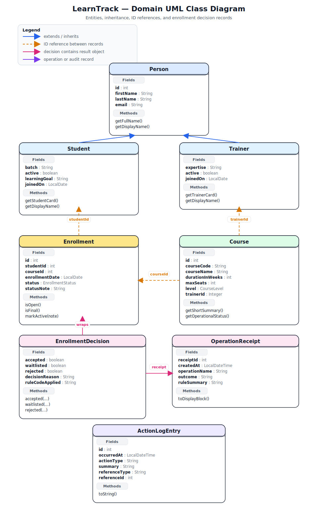

The README shows the domain UML diagram first. The remaining diagrams cover inheritance, services, enrollment lifecycle, runtime workflow, console navigation, and package inventory.

| File | Use it for |
|---|---|
| `docs/system_architecture_diagrams/01_Domain_UML_Class_Diagram.svg` | Class diagram for core entities, inheritance, ID references, enrollment decisions, receipts, and action log records |
| `docs/system_architecture_diagrams/02_OOP_Inheritance_Polymorphism.svg` | OOP explanation: `Person`, `Student`, `Trainer`, overriding, and `ArrayList<Person>` polymorphism |
| `docs/system_architecture_diagrams/03_Service_Responsibility_Map.svg` | Service ownership and separation of concerns |
| `docs/system_architecture_diagrams/04_Enrollment_Lifecycle_State_Machine.svg` | Enrollment status lifecycle and valid transitions |
| `docs/system_architecture_diagrams/05_Enrollment_Runtime_Workflow.svg` | Runtime behavior of the main enrollment use case |
| `docs/system_architecture_diagrams/06_Console_Navigation_Map.svg` | Console UI structure and important menu actions |
| `docs/system_architecture_diagrams/07_Package_Class_Inventory.svg` | Full package and class inventory |

## Demo screenshots

These screenshots come from the current console output and smoke test. Together they cover setup verification, menu flow, in-memory data, reports, OOP/polymorphism, enrollment decisions, waitlist promotion, receipts, action journal, and exception handling.

| Step | Covers | Screenshot |
|---|---|---|
| 1 | Compile and smoke test verification | 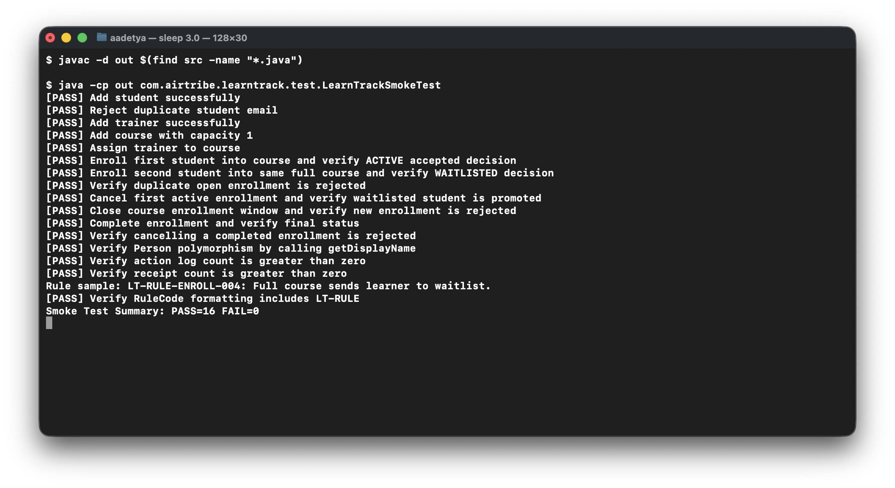 |
| 2 | Main menu and demo data load | 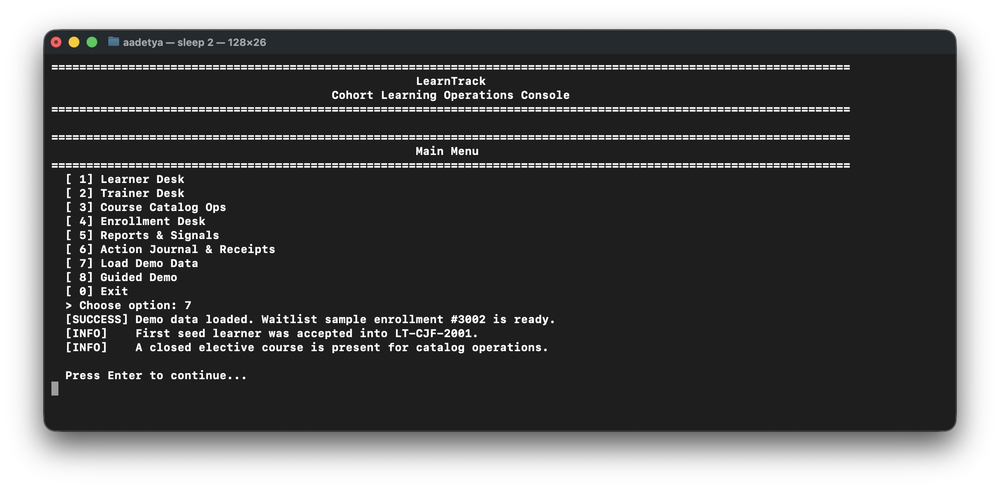 |
| 3 | Learning Pulse Dashboard report | 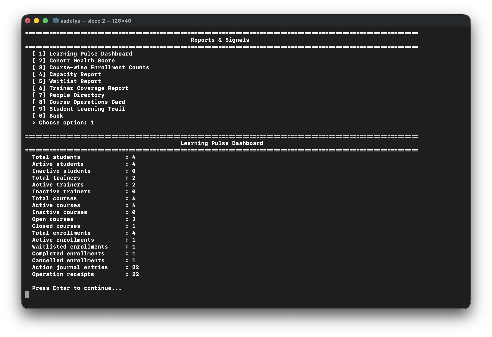 |
| 4 | Capacity report using course seat data | 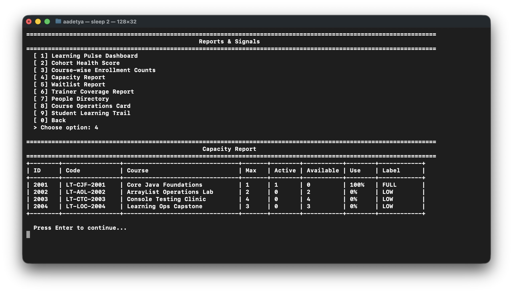 |
| 5 | People Directory showing `Person` polymorphism | 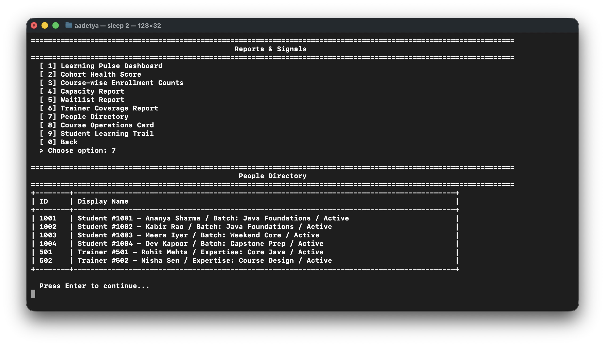 |
| 6 | Course Operations Card with trainer, capacity, and waitlist state | 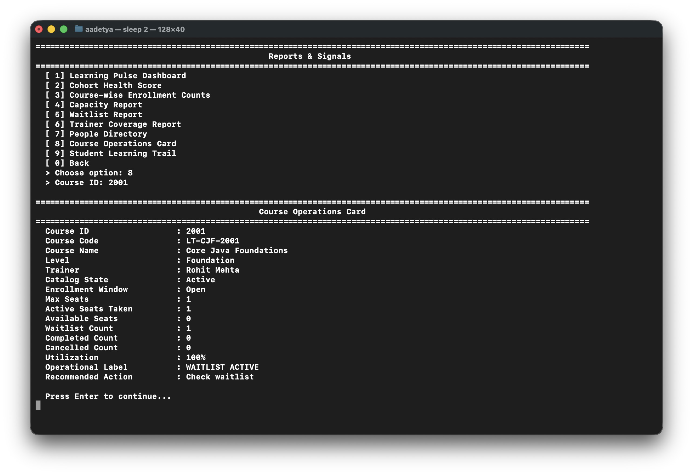 |
| 7 | Student Learning Trail preserving enrollment history | 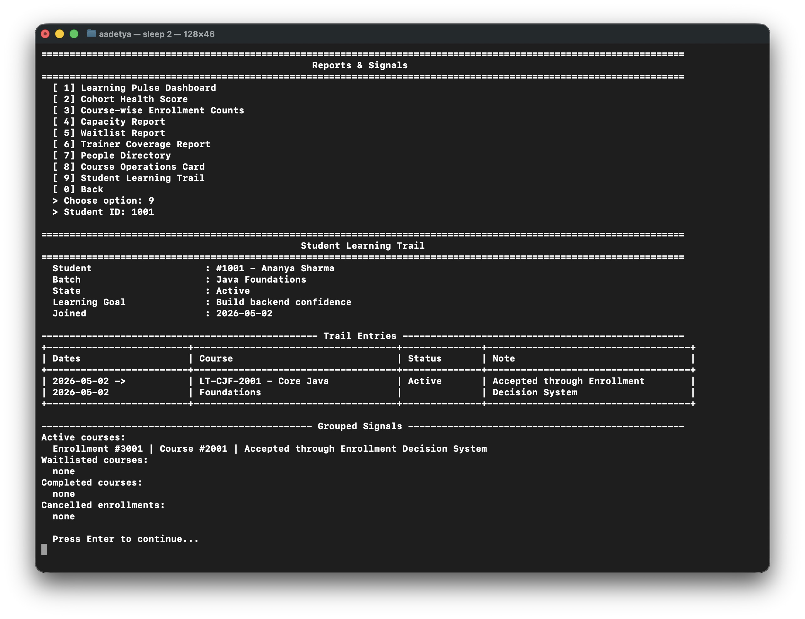 |
| 8 | Guided Demo accepted and waitlisted enrollment decisions | 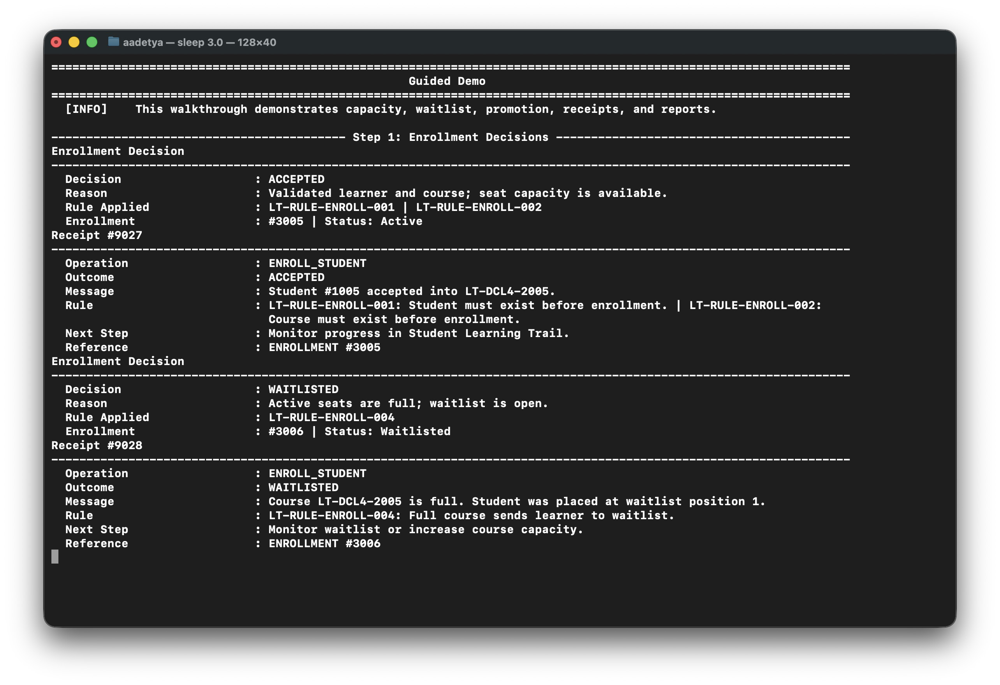 |
| 9 | Cancellation, automatic waitlist promotion, receipts, and journal entries | 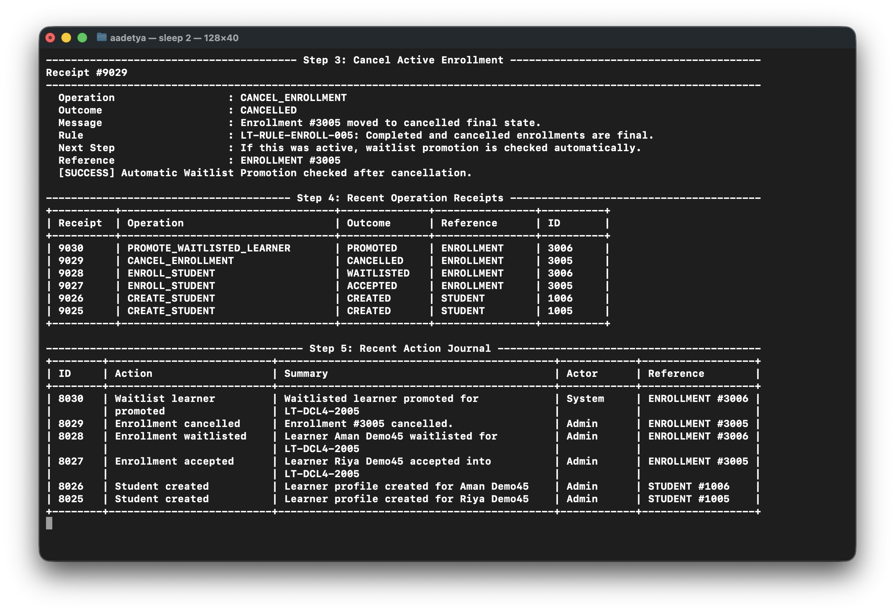 |
| 10 | Cohort Health Score and operating signals | 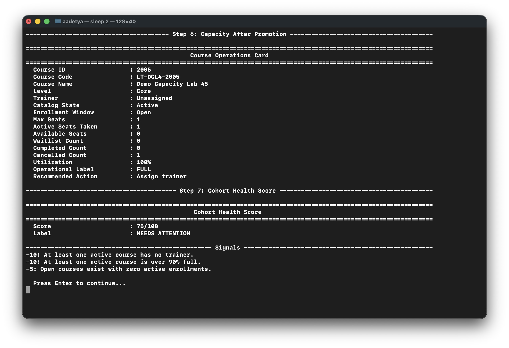 |
| 11 | Action Journal audit trail | 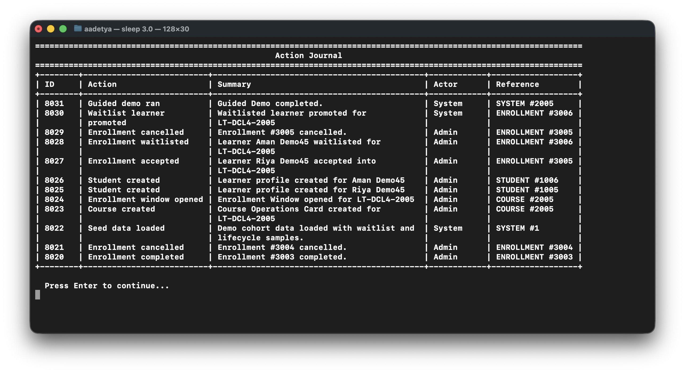 |
| 12 | Operation receipts for important mutations | 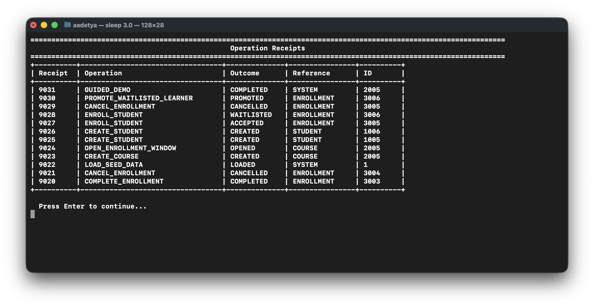 |
| 13 | Invalid menu input handled with a rule-coded error | 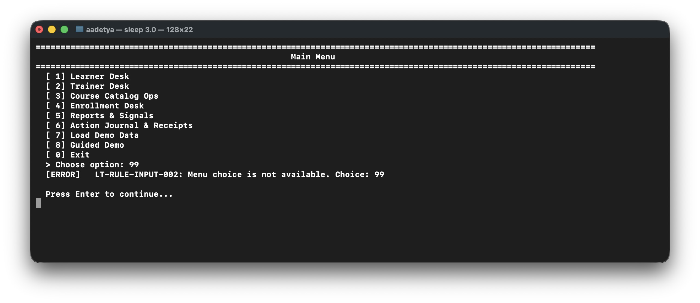 |

## Current scope limit

All data is in memory. Records disappear when the program exits because the assignment focuses on Core Java fundamentals, not databases or file persistence.
